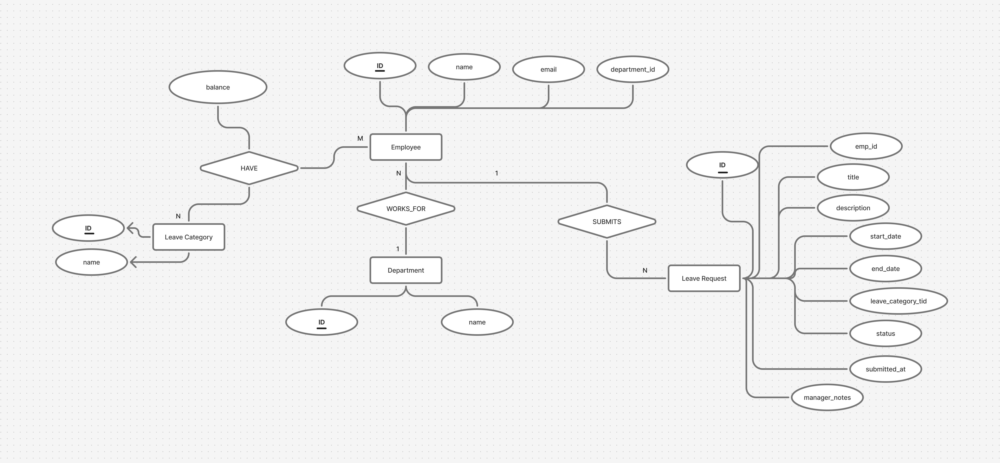
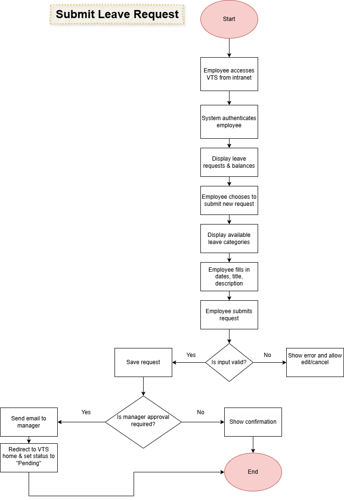
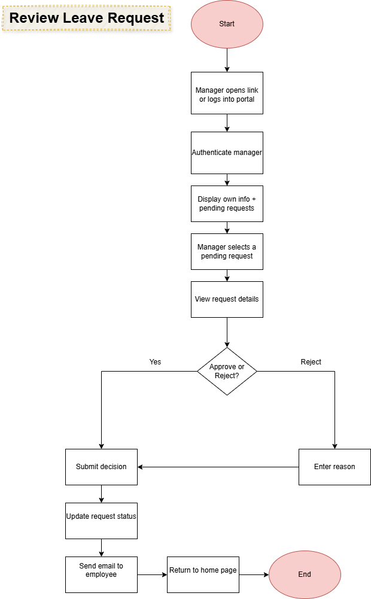
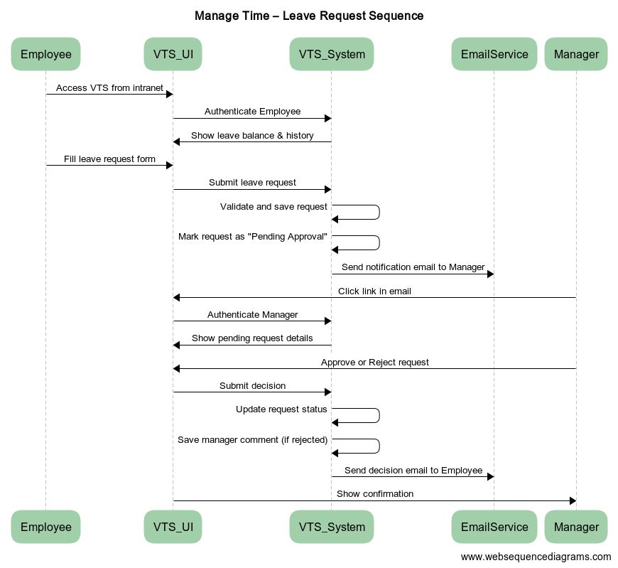

### 📝 Use Case Name: 
**Manage Time**

---

### 👤 Actor: 
**Employee**

---

### 🎯 Goal: 
Allow the employee to submit a vacation or leave request and track its status.

---

### ✅ Preconditions:
The employee must be logged into the system and authenticated as a valid company employee.

---

<details>
<summary>🔁 Main Flow</summary>

#### 🧑‍💼 Employee Actions:
1. The employee accesses the **VTS** via the intranet portal.
2. The system authenticates the user and displays:
   - Past leave requests (last 6 months)
   - Future requests (up to 18 months ahead)
   - Current leave balances
3. The employee chooses to create a new leave request.
4. The system displays available leave categories with a positive balance.
5. The employee:
   - Selects dates using a calendar
   - Specifies hours per day
   - Enters a short title and description
6. The employee submits the request.
7. The system validates the data:
   - If invalid → errors are shown and the employee can edit or cancel
   - If valid → request is saved
8. If approval is required, an email is sent to the manager.
9. The employee is redirected to the VTS homepage, and the request is marked as **Pending Approval**.

#### 👨‍💼 Manager Actions:
10. The manager opens the request via email link or logs in through the portal.
11. After authentication, the manager views:
    - Their own leave info
    - Pending approval requests from employees
12. The manager opens a request and reviews the details.
13. The manager approves or rejects the request:
    - Rejection requires a reason
14. The system updates the request status and notifies the employee by email.
15. The manager is returned to the VTS homepage and may:
    - Review more requests
    - Submit their own
    - Exit the system

</details>

---

### 🗃️ Related Data Model

This use case interacts with the following entities from the system ERD:

- `Employee`
- `Leave Request`



---

### 🧭 Flowcharts

#### 👤 Employee Flowchart:


#### 👨‍💼 Manager Flowchart:


---

<details>
<summary>🧠 Pseudo-code – Expand to View</summary>

### 🧑‍💼 EMPLOYEE SECTION

```pseudo
FUNCTION accessVTS(employeeId)
    IF NOT isLoggedIn(employeeId) THEN
        DISPLAY "You must log in to continue."
        RETURN
    ENDIF

    showEmployeeLeaveHistory(employeeId)
    showAvailableLeaveBalance(employeeId)

    CHOICE = prompt("Do you want to create a new leave request?")
    IF CHOICE == "Yes" THEN
        CALL submitLeaveRequest(employeeId)
    ENDIF
END FUNCTION
```
```pseudo
FUNCTION submitLeaveRequest(employeeId)
    leaveType = prompt("Select leave type")
    
    IF NOT hasPositiveBalance(employeeId, leaveType) THEN
        DISPLAY "No balance for selected leave type"
        RETURN
    ENDIF

    startDate = prompt("Enter start date")
    endDate = prompt("Enter end date")
    title = prompt("Enter title")
    description = prompt("Enter description")

    IF NOT isValidDates(startDate, endDate) THEN
        DISPLAY "Invalid date range"
        RETURN
    ENDIF

    requestId = createLeaveRequest(
        employeeId, leaveType, startDate, endDate,title, description
    )

    IF leaveTypeRequiresApproval(leaveType) THEN
        sendApprovalEmailToManager(employeeId, requestId)
        updateRequestStatus(requestId, "Pending Approval")
    ELSE
        updateRequestStatus(requestId, "Auto Approved")
    ENDIF

    DISPLAY "Leave request submitted successfully"
END FUNCTION
```

### 🧑‍💼 MANAGER SECTION
```pseudo
FUNCTION managerReviewsRequests(managerId)
    IF NOT isLoggedIn(managerId) THEN
        DISPLAY "You must log in as a manager."
        RETURN
    ENDIF

    pendingRequests = getPendingRequestsForManager(managerId)
    
    FOR request IN pendingRequests
        DISPLAY request.details
        decision = prompt("Approve or Reject?")

        IF decision == "Reject" THEN
            reason = prompt("Enter rejection reason")
            updateRequestStatus(request.id, "Rejected")
            storeManagerComment(request.id, reason)
        ELSE
            updateRequestStatus(request.id, "Approved")
        ENDIF

        notifyEmployee(request.employeeId, request.id)
    ENDFOR

    DISPLAY "All requests processed."
END FUNCTION
```

</details>

-----


### 🔄 Sequence Diagram

The following diagram illustrates the sequence of interactions between the employee, system components, and manager during the **Manage Time** process:


